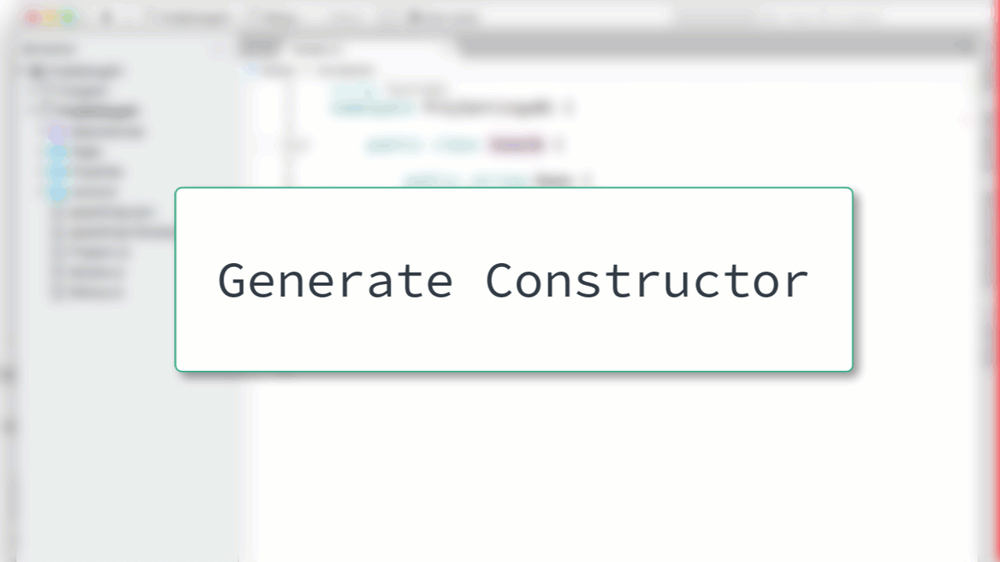

# Generate Constructor

You can easily generate a new constructor in your class by using the Generate Constructor window.

After opening the Generate Constructor window, you can select the members that you'd like to include in the new caonstructor.