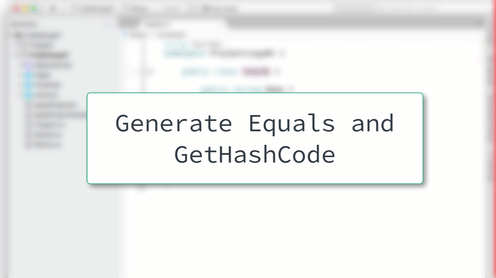

# Generate Equals

When you need to implement `Equals()` or `GetHashCode()` you can generate those in Visual Studio for Mac.

After the window opens, you can specify the members that should be included in the comparison as well as a couple of other options.