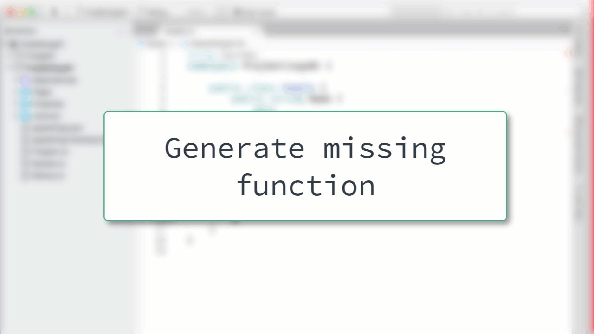

# Generate Missing Function

When authoring code sometimes you need to create a new method, or function, and then call that. In this case you can make a call into a non-existent function and then generate the function.

