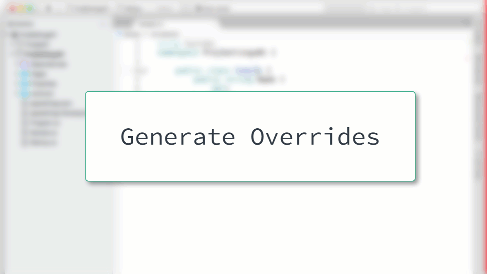

# Generate Overrides

When you need to override methods from a base class you can quickly generate method stubs with the Generate Overrides window.

After the window opens, you can specify the methods that should be generated.